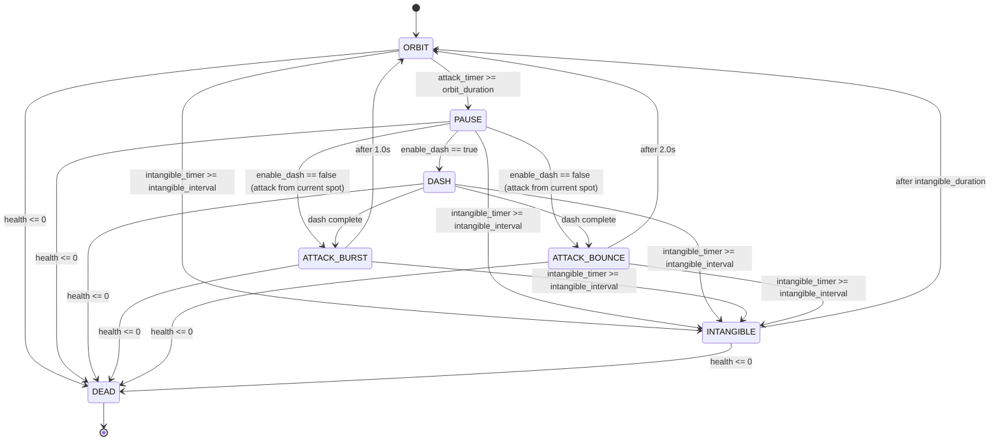

# Phantoon Boss Logic

Script: `Scripts/Enemies/phantoon.gd`
Scene: `Scenes/Enemies/phantoon.tscn`

Phantoon is an orbiting boss that alternates between circling an arena center point, dashing to a new position, and firing one of two attacks. It has two health-based phases and a periodic invulnerability window.

## States (`BossState` enum)

| State | Purpose |
|---|---|
| `ORBIT` | Circles `arena_center` at `orbit_radius`/`orbit_speed`. Default/resting state. |
| `PAUSE` | Stops orbiting briefly before dashing (or before attacking, if dash is disabled). |
| `DASH` | Interpolates position to a random point on the orbit circle. |
| `ATTACK_BURST` | Radial burst attack is in-flight; boss holds position. |
| `ATTACK_BOUNCE` | Bouncing fireball attack is in-flight; boss holds position. |
| `INTANGIBLE` | Boss is translucent, invulnerable, and its Hurtbox is disabled. |
| `DEAD` | Boss is fading out and about to `queue_free()`. |

## State machine flow



Notes:
- The intangibility check runs every physics frame regardless of current state (except while already `DEAD` or `INTANGIBLE`), so it can interrupt `ORBIT`, `PAUSE`, `DASH`, or either attack state the instant its timer elapses. It does **not** interrupt an attack visually (the attack was already spawned), it just forces the next state to `INTANGIBLE` once the timer condition is met and the current per-state update runs.
- Death (`take_damage` → `HealthComponent` → `died` signal) can happen from any state and immediately forces `DEAD`, disabling all `CollisionShape2D`/`Area2D` children.

## Transition timings (defaults)

| Transition | Duration/condition |
|---|---|
| `ORBIT` → `PAUSE` | `orbit_duration` (3.0s, phase 1) |
| `PAUSE` → `DASH` (or directly to attack if `enable_dash = false`) | `pause_duration` (1.0s, phase 1) |
| `DASH` → attack state | `dash_duration` (0.5s) |
| `ATTACK_BURST` → `ORBIT` | fixed 1.0s |
| `ATTACK_BOUNCE` → `ORBIT` | fixed 2.0s |
| any → `INTANGIBLE` | `intangible_interval` (15.0s, phase 1) |
| `INTANGIBLE` → `ORBIT` | `intangible_duration` (3.0s) |

In Phase 2 (`enter_phase_2()`), `orbit_speed` is multiplied by 1.5, `pause_duration` by 0.75, and `orbit_duration` by 0.8 — the boss orbits faster, pauses for less time, and starts its attack cycle sooner. `intangible_interval`/`intangible_duration` are unaffected by phase.

## Attack selection probability (`perform_attack_selection()`)

Every time the boss reaches the end of a dash (or skips the dash, if disabled), it picks **one** attack:

```gdscript
var bounce_chance = 0.3 if phase == 1 else 0.5
var do_bounce = enable_bounce_attack and (not enable_burst_attack or randf() < bounce_chance)
```

- **Phase 1:** ~30% chance of `ATTACK_BOUNCE`, ~70% chance of `ATTACK_BURST`.
- **Phase 2:** ~50% / 50% split.
- If only one attack toggle is enabled, that attack is always used (100%), regardless of `bounce_chance`.
- If both `enable_burst_attack` and `enable_bounce_attack` are `false`, no attack is spawned and the boss returns straight to `ORBIT`.

This is why the bouncing fireballs feel rare in Phase 1: they only have a **30% chance** of being picked each attack cycle, versus 70% for the burst. Since each orbit → pause → dash → attack cycle takes roughly `orbit_duration + pause_duration + dash_duration` (~4.5s in phase 1) before an attack is even chosen, you'll statistically see a bounce attack roughly once every ~3-4 attack cycles (~15s) in Phase 1. To make bounce attacks appear more often for testing, either temporarily raise `bounce_chance` in code, or set `enable_burst_attack = false` to force 100% bounce attacks.

## Attacks

### Radial Burst (`spawn_burst_attack`)
- Spawns `burst_projectile_count` (default 6) `RadialProjectile` instances in an evenly spaced ring (`TAU / burst_projectile_count` apart), offset by `phase_1_burst_rotation`/`phase_2_burst_rotation`.
- Each projectile spawns at `global_position + direction * burst_spawn_offset` (24px outside the boss's own body by default) so it doesn't visually spawn inside the boss sprite.
- Speed is `phase_1_burst_speed` (100) or `phase_2_burst_speed` (150) depending on phase.
- Projectiles fly in a straight line and self-destruct (fade) on hitting a wall, the player, or after their lifetime expires.

### Bouncing Fireballs (`spawn_bounce_attack`)
- Spawns `phase_1_bounce_count` (4) or `phase_2_bounce_count` (6) `BouncingFireball` instances in a horizontal line 40px below the boss, evenly spaced 20px apart and centered under the boss.
- Each fireball falls under `bounce_gravity` and bounces off floors up to `MAX_BOUNCES` (5) times, losing speed each bounce, before self-destructing.

## Phases

- **Phase 1:** default values, `bounce_chance = 0.3`.
- **Phase 2:** triggered once when `health.current_health <= max_health / 2`. Increases orbit speed and attack frequency, and raises `bounce_chance` to `0.5`. Triggers a brief white flash on the sprite as a visual cue. Phase 2 only triggers once (`phase_2_triggered` guard).

## Damage & Death

- `take_damage()` is ignored while `INTANGIBLE` or `DEAD`.
- Taking damage flashes the sprite red briefly (`damage_flash_timer`, 0.12s) and checks for the Phase 2 transition.
- On death (`HealthComponent.died` signal), the boss disables all its `CollisionShape2D`/`Area2D` children, fades its sprite out over `death_duration` (0.5s), then `queue_free()`s.

## Feature toggles (for testing)

All default to `true`, meant to be disabled individually for isolated testing:

- `enable_dash` — if `false`, the boss skips the dash and attacks immediately from its current orbit position after the pause.
- `enable_burst_attack` — if `false`, only bounce attacks are ever chosen.
- `enable_bounce_attack` — if `false`, only burst attacks are ever chosen.
- `enable_intangibility` — if `false`, the boss never becomes intangible.
